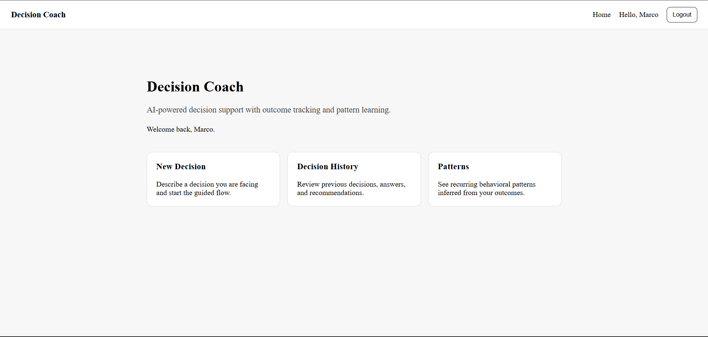
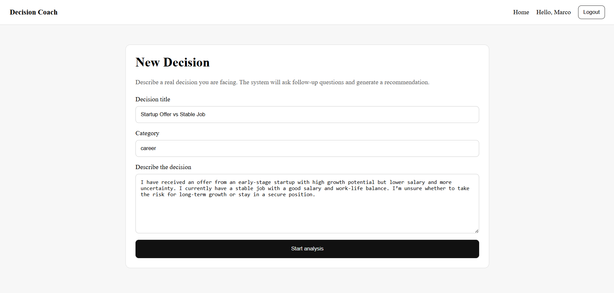
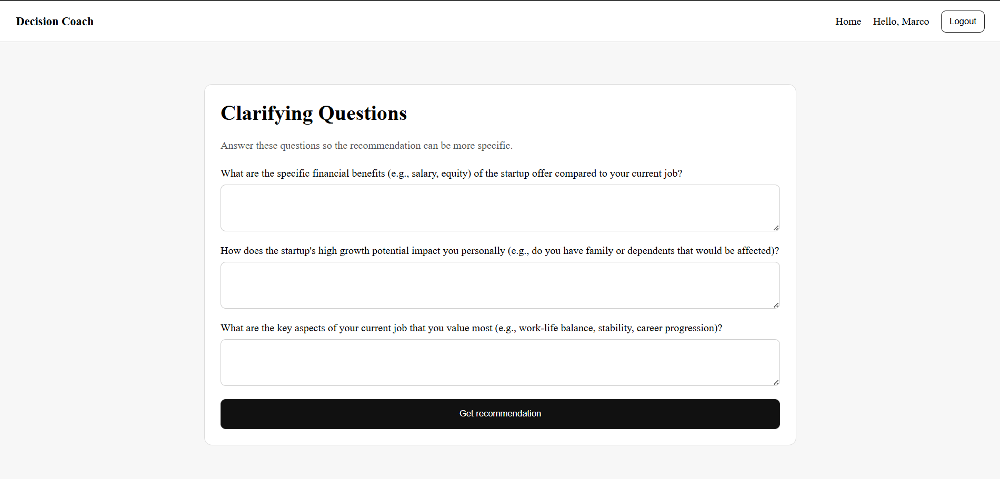
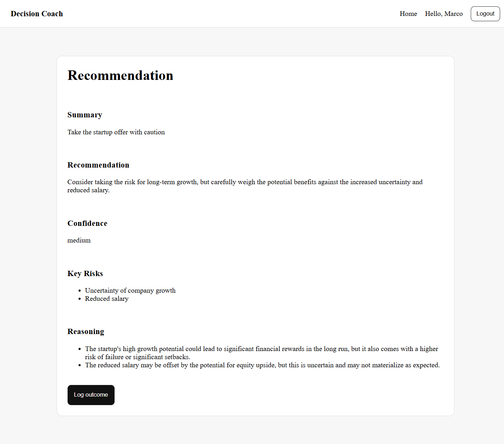
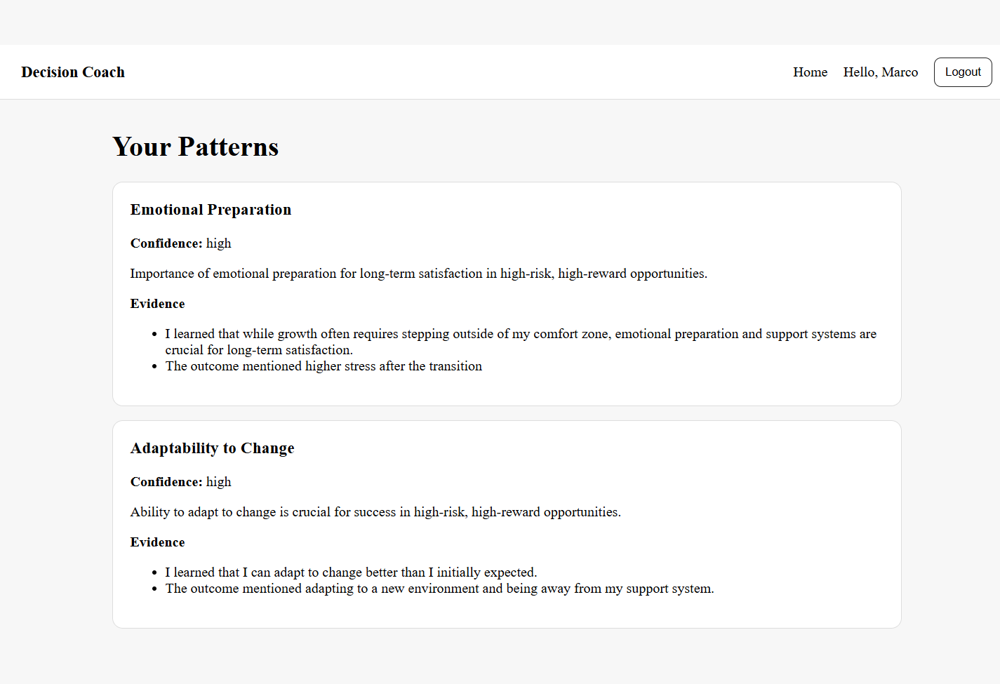

# Decision Coach 🧠

AI-powered decision support system that helps you think through complex choices, generate structured recommendations, and learn from your past decisions over time.

---

## 🚀 Overview

Decision Coach guides users through a complete decision-making loop:

1. Describe a decision
2. Answer clarifying questions
3. Receive a structured recommendation
4. Log the outcome
5. Discover behavioral patterns over time

The system uses an LLM to generate insights and continuously improves based on your decisions and outcomes.

---

## ✨ Features

- 🔐 User authentication (register & login)
- 🧾 Decision creation and tracking
- 🤖 AI-generated clarifying questions
- 🧠 Structured recommendations (summary, risks, reasoning)
- 📊 Outcome logging and reflection
- 🔁 Pattern detection from past behavior
- 📚 Decision history overview
 

---

## 🖼️ Screenshots

### Home

### New Decision

### Clarifying Questions

### Recommendation

### Patterns

---

## 🛠️ Tech Stack

**Frontend**
- Next.js
- React
- TypeScript

**Backend**
- FastAPI
- SQLAlchemy
- Pydantic

**Database**
- SQLite

**AI / LLM**
- Ollama (local model inference)

---

## ⚙️ Setup

### 1. Clone the repository

git clone https://github.com/iliakhashaei/decision-coach.git
cd decision-coach

### 2. Backend setup

cd backend
python -m venv .venv
.venv\Scripts\activate   # Windows
pip install -r requirements.txt

Create a .env file based on .env.example:

copy .env.example .env   # Windows

Run the backend:

uvicorn app.main:app --reload

### 3. Frontend setup

cd frontend
npm install
npm run dev

## 🔄 How It Works
The user submits a decision
The system generates clarifying questions using an LLM
Answers are used to generate a recommendation
The user logs the real outcome later
The system analyzes past outcomes to detect behavioral patterns

## 📌 Notes
This project is an MVP focused on the full decision lifecycle
LLM responses are structured and parsed into usable outputs
Patterns are inferred from historical outcomes and reflections

## Future Improvements
Better pattern aggregation across multiple decisions
Personalized recommendations based on user history
UI/UX enhancements
Deployment (Docker / cloud)

## License
No license specified yet.

